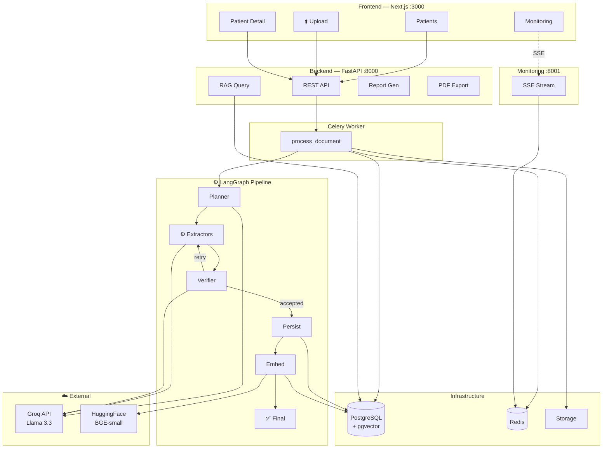

# MedDocs AI Architecture Diagram

Paste this into [mermaid.live](https://mermaid.live) to generate a PNG/SVG.

## How to Generate Image

1. Go to [mermaid.live](https://mermaid.live)
2. Paste the mermaid code above
3. Click **Actions → Download SVG** or **Download PNG**
4. Save to `docs/architecture.png`
